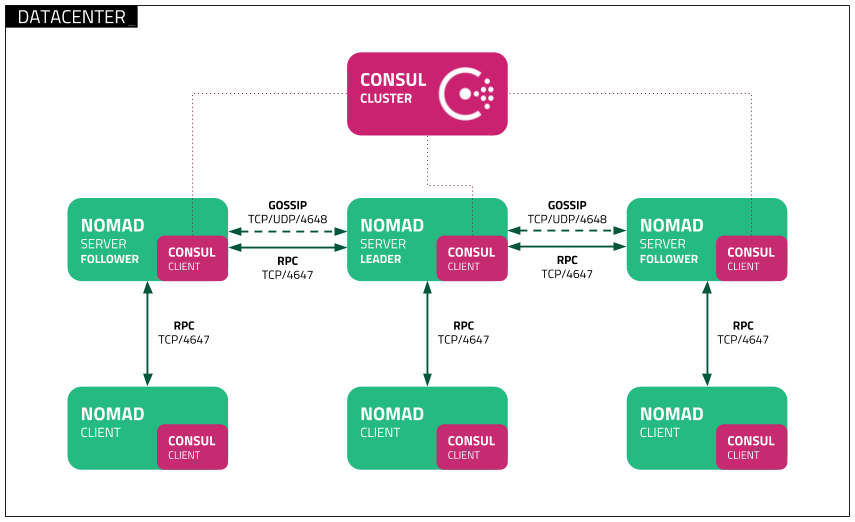

<!--
N.B.: Questo README è stato automaticamente generato da <https://github.com/YunoHost/apps/tree/master/tools/readme_generator>
NON DEVE essere modificato manualmente.
-->

# Nomad per YunoHost

[](https://dash.yunohost.org/appci/app/nomad)  

[](https://install-app.yunohost.org/?app=nomad)

*[Leggi questo README in altre lingue.](./ALL_README.md)*

> *Questo pacchetto ti permette di installare Nomad su un server YunoHost in modo semplice e veloce.*  
> *Se non hai YunoHost, consulta [la guida](https://yunohost.org/install) per imparare a installarlo.*

## Panoramica

Nomad is a simple and flexible workload orchestrator to deploy and manage containers ([docker](https://www.nomadproject.io/docs/drivers/docker.html), [podman](https://www.nomadproject.io/docs/drivers/podman)), non-containerized applications ([executable](https://www.nomadproject.io/docs/drivers/exec.html), [Java](https://www.nomadproject.io/docs/drivers/java)), and virtual machines ([qemu](https://www.nomadproject.io/docs/drivers/qemu.html)) across on-prem and clouds at scale.


**Versione pubblicata:** 1.3.5~ynh1

## Screenshot



## Attenzione/informazioni importanti

## Some Nomad Job examples

### Busybox

`lxc-create --name=busybox --template=busybox`

```
job "job-busybox" {
  datacenters = ["dc1"]
  type        = "service"

  group "group-busybox" {
    task "task-busybox" {
      driver = "lxc"

      config {
        log_level = "info"
        verbosity = "verbose"
        template  = "/usr/share/lxc/templates/lxc-busybox"
      }

      resources {
        cpu    = 500
        memory = 256
      }
    }
  }
}
```

### Debian

`lxc-create --name=debian --template=debian`

```
job "job-debian" {
  datacenters = ["dc1"]
  type        = "service"

  group "group-debian" {
    task "task-debian" {
      driver = "lxc"

      config {
        log_level = "info"
        verbosity = "verbose"
        template  = "/usr/share/lxc/templates/lxc-debian"
      }

      resources {
        cpu    = 500
        memory = 256
      }
    }
  }
}
```

### Debian Stretch

`lxc-create --name=stretch --template=debian -- --release=stretch`

```
job "job-stretch" {
  datacenters = ["dc1"]
  type        = "service"

  group "group-stretch" {
    task "task-stretch" {
      driver = "lxc"

      config {
        log_level = "info"
        verbosity = "verbose"
        template  = "/usr/share/lxc/templates/lxc-debian"
		template_args = ["--release=stretch"]
      }

      resources {
        cpu    = 500
        memory = 256
      }
    }
  }
}
```

### Debian Buster

`lxc-create --name=buster --template=debian -- --release=buster`

```
job "job-buster" {
  datacenters = ["dc1"]
  type        = "service"

  group "group-buster" {
    task "task-buster" {
      driver = "lxc"

      config {
        log_level = "info"
        verbosity = "verbose"
        template  = "/usr/share/lxc/templates/lxc-debian"
		template_args = ["--release=buster"]
      }

      resources {
        cpu    = 500
        memory = 256
      }
    }
  }
}
```

### Debian Buster from images.linuxcontainers.org

`lxc-create --name=download-buster --template=download -- --dist=debian --release=buster --arch=amd64 --keyserver=hkp://keyserver.ubuntu.com`

```
job "job-download-buster" {
  datacenters = ["dc1"]
  type        = "service"

  group "group-download-buster" {
    task "task-download-buster" {
      driver = "lxc"

      config {
        log_level = "info"
        verbosity = "verbose"
        template  = "/usr/share/lxc/templates/lxc-download"
		template_args = ["--dist=debian","--release=buster","--arch=amd64","--keyserver=hkp://keyserver.ubuntu.com"]
      }

      resources {
        cpu    = 500
        memory = 256
      }
    }
  }
}
```

### Debian Bullseye from images.linuxcontainers.org

`lxc-create --name=download-bullseye --template=download -- --dist=debian --release=bullseye --arch=amd64 --keyserver=hkp://keyserver.ubuntu.com`

```
job "job-download-bullseye" {
  datacenters = ["dc1"]
  type        = "service"

  group "group-download-bullseye" {
    task "task-download-bullseye" {
      driver = "lxc"

      config {
        log_level = "info"
        verbosity = "verbose"
        template  = "/usr/share/lxc/templates/lxc-download"
		template_args = ["--dist=debian","--release=bullseye","--arch=amd64","--keyserver=hkp://keyserver.ubuntu.com"]
      }

      resources {
        cpu    = 500
        memory = 256
      }
    }
  }
}
```

## Documentazione e risorse

- Sito web ufficiale dell’app: <https://www.nomadproject.io/>
- Documentazione ufficiale per gli amministratori: <https://www.nomadproject.io/docs>
- Repository upstream del codice dell’app: <https://github.com/hashicorp/nomad>
- Store di YunoHost: <https://apps.yunohost.org/app/nomad>
- Segnala un problema: <https://github.com/YunoHost-Apps/nomad_ynh/issues>

## Informazioni per sviluppatori

Si prega di inviare la tua pull request alla [branch di `testing`](https://github.com/YunoHost-Apps/nomad_ynh/tree/testing).

Per provare la branch di `testing`, si prega di procedere in questo modo:

```bash
sudo yunohost app install https://github.com/YunoHost-Apps/nomad_ynh/tree/testing --debug
o
sudo yunohost app upgrade nomad -u https://github.com/YunoHost-Apps/nomad_ynh/tree/testing --debug
```

**Maggiori informazioni riguardo il pacchetto di quest’app:** <https://yunohost.org/packaging_apps>
