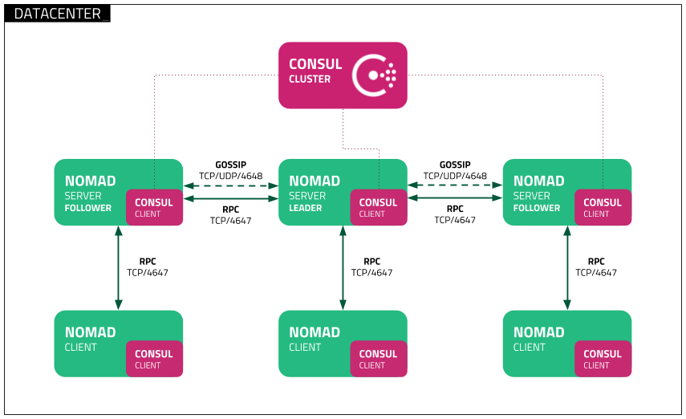

<!--
Важно: этот README был автоматически сгенерирован <https://github.com/YunoHost/apps/tree/master/tools/readme_generator>
Он НЕ ДОЛЖЕН редактироваться вручную.
-->

# Nomad для YunoHost

[](https://ci-apps.yunohost.org/ci/apps/nomad/)


[](https://install-app.yunohost.org/?app=nomad)

*[Прочтите этот README на других языках.](./ALL_README.md)*

> *Этот пакет позволяет Вам установить Nomad быстро и просто на YunoHost-сервер.*  
> *Если у Вас нет YunoHost, пожалуйста, посмотрите [инструкцию](https://yunohost.org/install), чтобы узнать, как установить его.*

## Обзор

Nomad is a simple and flexible workload orchestrator to deploy and manage containers ([docker](https://www.nomadproject.io/docs/drivers/docker.html), [podman](https://www.nomadproject.io/docs/drivers/podman)), non-containerized applications ([executable](https://www.nomadproject.io/docs/drivers/exec.html), [Java](https://www.nomadproject.io/docs/drivers/java)), and virtual machines ([qemu](https://www.nomadproject.io/docs/drivers/qemu.html)) across on-prem and clouds at scale.


**Поставляемая версия:** 1.7.7~ynh3

## Снимки экрана



## Документация и ресурсы

- Официальный веб-сайт приложения: <https://www.nomadproject.io>
- Официальная документация администратора: <https://www.nomadproject.io/docs>
- Репозиторий кода главной ветки приложения: <https://github.com/hashicorp/nomad>
- Магазин YunoHost: <https://apps.yunohost.org/app/nomad>
- Сообщите об ошибке: <https://github.com/YunoHost-Apps/nomad_ynh/issues>

## Информация для разработчиков

Пришлите Ваш запрос на слияние в [ветку `testing`](https://github.com/YunoHost-Apps/nomad_ynh/tree/testing).

Чтобы попробовать ветку `testing`, пожалуйста, сделайте что-то вроде этого:

```bash
sudo yunohost app install https://github.com/YunoHost-Apps/nomad_ynh/tree/testing --debug
или
sudo yunohost app upgrade nomad -u https://github.com/YunoHost-Apps/nomad_ynh/tree/testing --debug
```

**Больше информации о пакетировании приложений:** <https://yunohost.org/packaging_apps>
